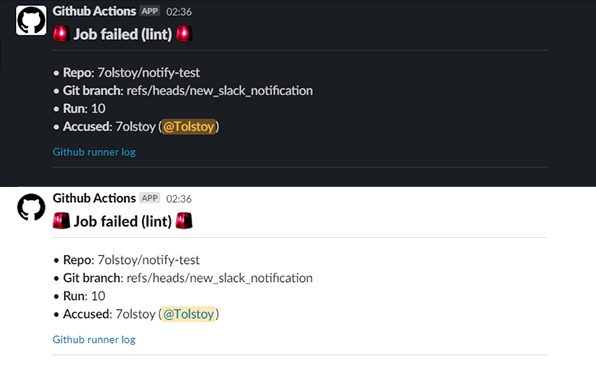

# slack-notification-action

This action will send alert to your slack channel/PM and additionally mention you.

# Requirements
First of all you need to create your slack app with these items and use them in ```with``` section of the action.
### ```slack-url```
Go to your slack app ([Your Apps](https://api.slack.com/apps)->Features->Incoming Webhooks) and add new webhook URL for your workspace. After you can use this URL in actions.
### ```slack-oauth-token```
The action requires an OAuth token token for your slack workspace with ```users:read.email```([doc](https://api.slack.com/scopes/users:read.email)) permission.

# Usage
See [action.yml](action.yml)

Basic:
```yaml
steps:
- uses: actions/checkout@v2
- uses: 7olstoy/slack-notification-action@main
  with:
    slack-url: ${{ secrets.SLACK_TEST_CHANNEL_URL }}
    slack-oauth-token: ${{ secrets.SLACK_BOT_OAUTH_TOKEN }}
```

Advanced:
```yaml
jobs:
  shellcheck:
    name: Lint with Shellcheck
    runs-on: ubuntu-latest
    steps:
    - uses: actions/checkout@v2
    - name: Run ShellCheck
      uses: ludeeus/action-shellcheck@master
      with:
        format: tty
    - uses: 7olstoy/slack-notification-action@main
      with:
        slack-url: ${{ secrets.SLACK_TEST_CHANNEL_URL }}
        slack-oauth-token: ${{ secrets.SLACK_BOT_OAUTH_TOKEN }}
      if: failure()
```

# License

The scripts and documentation in this project are released under the [MIT License](LICENSE)


